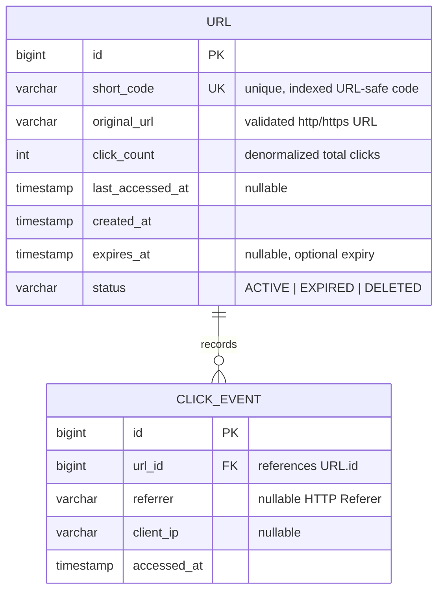

# ER Diagram — Data Model

## Notes

- `URL.short_code` is unique and indexed to guarantee O(1) lookups (REQ-SHORT-002).
- `URL.click_count` and `URL.last_accessed_at` are denormalized aggregates updated on
  each redirect for fast analytics reads (REQ-SHORT-005).
- Each redirect also appends a `CLICK_EVENT` row, preserving per-hit referrer history
  for the analytics endpoint (REQ-SHORT-006).
- `URL.expires_at` is nullable — a null value means the short URL never expires
  (REQ-SHORT-007).