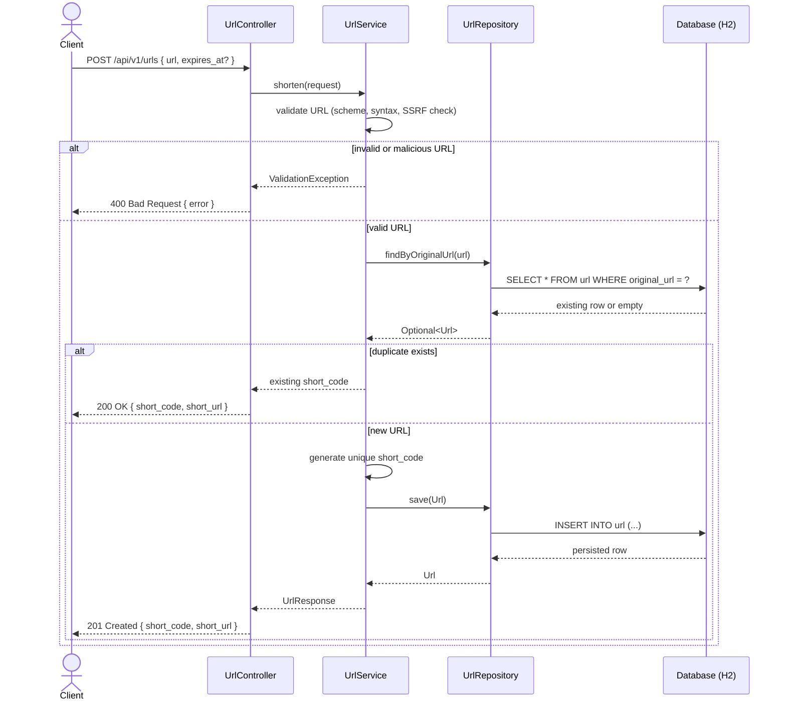

# Sequence Diagram — Shorten then Redirect

## Shorten a URL



## Redirect via a short code

```mermaid
sequenceDiagram
    actor Client
    participant Controller as RedirectController
    participant Service as UrlService
    participant Repository as UrlRepository
    participant DB as Database (H2)

    Client->>Controller: GET /{shortCode}
    Controller->>Service: resolve(shortCode, referer)
    Service->>Repository: findByShortCode(shortCode)
    Repository->>DB: SELECT * FROM url WHERE short_code = ?
    DB-->>Repository: row or empty
    Repository-->>Service: Optional<Url>
    alt short code not found
        Service-->>Controller: NotFoundException
        Controller-->>Client: 404 Not Found { error }
    else expired
        Service-->>Controller: GoneException
        Controller-->>Client: 410 Gone { error }
    else active
        Service->>Service: record click (count++, last_accessed, referrer)
        Service->>Repository: save(Url + ClickEvent)
        Repository->>DB: UPDATE url; INSERT INTO click_event
        DB-->>Repository: ok
        Service-->>Controller: original_url
        Controller-->>Client: 302 Found (Location: original_url)
    end
```