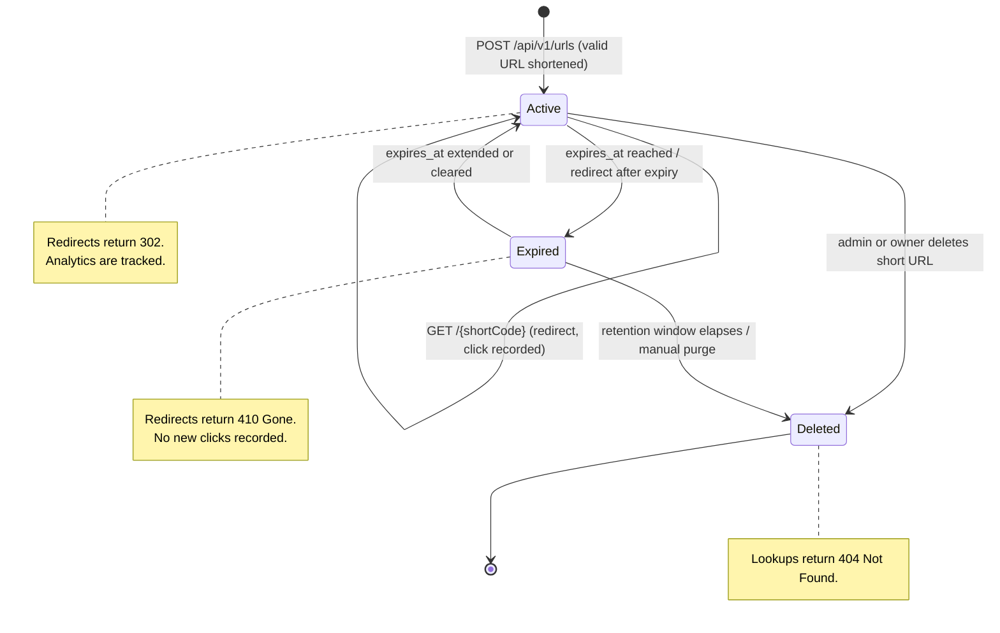

# State Diagram — URL Lifecycle

## Transitions

| From    | To       | Event                                                        |
|---------|----------|-------------------------------------------------------------|
| (start) | Active   | A valid URL is shortened (REQ-SHORT-001)                     |
| Active  | Active   | Short code is visited; click count / referrer recorded (REQ-SHORT-005) |
| Active  | Expired  | `expires_at` passes, or a redirect is requested after expiry (REQ-SHORT-007) |
| Active  | Deleted  | Short URL is removed by owner/admin                          |
| Expired | Deleted  | Retention window elapses or record is purged                |
| Expired | Active   | Expiration is extended or cleared                            |
| Deleted | (end)    | Record removed; lookups return 404 (REQ-SHORT-004)          |